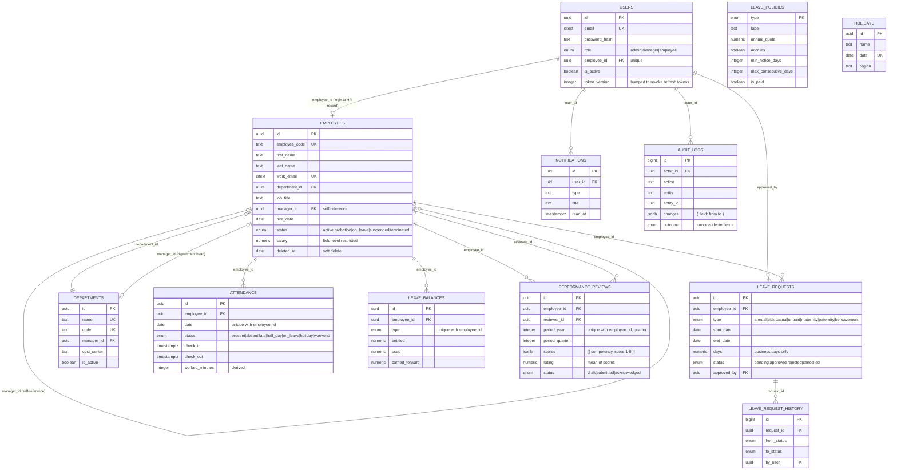

# Data model

> EmpCore runs on **PostgreSQL**. The diagram below shows the tables and their
> foreign keys; `server/db/schema.sql` is the authoritative DDL.

> The diagram is committed as **SVG** rather than PNG: it stays sharp at any zoom, the
> field names are selectable text, and it adapts to light and dark viewers. GitHub,
> VS Code and every browser render it inline. The Mermaid source below is the same
> model in text form, for anyone who prefers to regenerate or diff it.

---

## Mermaid source

---

## Design decisions worth defending

**`employees.manager_id` references `employees`, not `users`.**
Every manager is also an employee, and pointing the edge at `employees` makes the
reporting structure a single self-referencing tree that one recursive CTE can traverse.
Pointing it at `users` would split the hierarchy across two tables and would break for
a manager who has an HR record but no login yet.

**`users` and `employees` are separate tables.**
Authentication and HR data have different lifecycles. Someone can exist as an employee
before their login is provisioned, a login can be disabled while the employee record
stays for reporting, and contractors can hold records with no account at all. Merging
them would also mean loading `password_hash` on every employee list query.

**Embedded arrays were split by access pattern.**
On the document database, leave balances, leave history and review scores were all
embedded. In Postgres, `leave_balances` and `leave_request_history` became child tables
because they are queried and updated independently of their parent. Review `scores`
stayed together as `jsonb`, because they are always read and written as a whole and
never queried across rows.

**`attendance` is unique on `(employee_id, date)`.**
The database, not the application, guarantees one row per person per day. Corrections
upsert against that key, so a retry or a double-submit cannot produce two conflicting
records for the same day.

**`performance_reviews` is unique on `(employee_id, period_year, period_quarter)`.**
One review per person per period regardless of who writes it — which is why a second
manager cannot open a competing review for the same quarter.

**Soft delete instead of removal.**
`employees.deleted_at` is set rather than the row being deleted, because attendance,
leave and review rows all reference it and that history has to remain queryable.
A hard delete would either orphan those references or force a cascade that destroys the
record the system exists to keep.

**`leave_policies` and `holidays` hold no references.**
They are configuration, read at request time by the business-day calculator and the
scheduled jobs. Keeping them ref-free means changing a quota or adding a holiday never
requires touching existing employee or leave rows.

---

## Indexes

| Table | Index | Why |
|---|---|---|
| `users` | `email` (unique) | Login lookup |
| `users` | `employee_id` (unique), `role` | Reverse lookup and role filters |
| `employees` | `employee_code`, `work_email` (unique) | Identity |
| `employees` | `manager_id` | The recursive sub-tree walk |
| `employees` | `(department_id, status, deleted_at)` | The default list query |
| `employees` | `deleted_at` | Excluding soft-deleted rows |
| `attendance` | `(employee_id, date)` **unique** | One record per day |
| `attendance` | `(date, status)` | Monthly aggregation |
| `attendance` | `(employee_id, date desc)` | Calendar and summary reads |
| `leave_requests` | `(employee_id, start_date, end_date)` | Overlap detection |
| `leave_requests` | `(status, created_at desc)` | Approval queue |
| `leave_request_history` | `(request_id, at)` | Transition trail, in order |
| `leave_balances` | `(employee_id, type)` **unique** | One balance per type |
| `performance_reviews` | `(employee_id, period_year, period_quarter)` **unique** | One per period |
| `notifications` | `(user_id, read_at, created_at desc)` | Unread badge |
| `audit_logs` | `created_at desc`, `(entity, action)` | Trail browsing and filters |

### Constraints doing real work

Several business rules are enforced by the database rather than only in application
code, so they hold no matter which code path writes:

| Constraint | Rule |
|---|---|
| `employee_not_own_manager` | An employee cannot report to themselves |
| `review_not_self` | An employee cannot review themselves |
| `leave_dates_ordered` | `end_date >= start_date` |
| `attendance_checkout_after_checkin` | Check-out must be after check-in |
| `attendance (employee_id, date)` | No duplicate day, even under a concurrent retry |

Cycles further up the tree (A reports to B reports to A) cannot be expressed as a
single-row check, so those are caught in the application before the write — and
`subordinate_ids()` caps its depth so an undetected cycle degrades rather than hangs.
