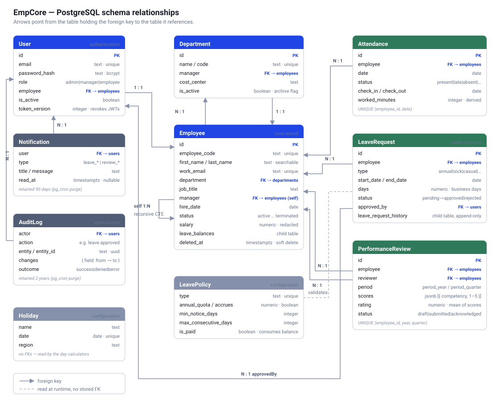
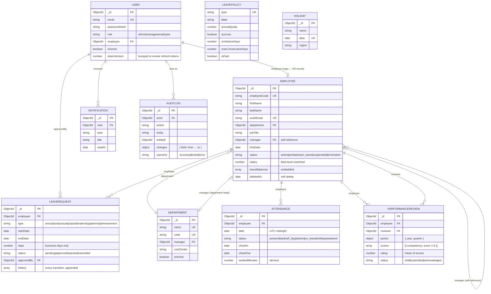

# Data model

> The diagram is committed as **SVG** rather than PNG: it stays sharp at any zoom, the
> field names are selectable text, and it adapts to light and dark viewers. GitHub,
> VS Code and every browser render it inline. The Mermaid source below is the same
> model in text form, for anyone who prefers to regenerate or diff it.

---

## Mermaid source

---

## Design decisions worth defending

**`Employee.manager` references `Employee`, not `User`.**
Every manager is also an employee, and pointing the edge at `Employee` makes the
reporting structure a single self-referencing tree that `$graphLookup` can traverse in
one query. Pointing it at `User` would split the hierarchy across two collections and
would break for a manager who has an HR record but no login yet.

**`User` and `Employee` are separate collections.**
Authentication and HR data have different lifecycles. Someone can exist as an employee
before their login is provisioned, a login can be disabled while the employee record
stays for reporting, and contractors can hold records with no account at all. Merging
them would also mean loading `passwordHash` on every employee list query.

**`leaveBalances` is embedded, `LeaveRequest` is referenced.**
Balances are small, bounded (one entry per policy), and always read with their
employee — the classic case for embedding. Leave requests are unbounded, queried
independently ("show me every pending request"), and updated on their own schedule,
so they get their own collection.

**`Attendance` has a unique compound index on `(employee, date)`.**
The database, not the application, guarantees one row per person per day. Corrections
upsert against that key, so a retry or a double-submit cannot produce two conflicting
records for the same day.

**`PerformanceReview` is unique on `(employee, period.year, period.quarter)`.**
One review per person per period regardless of who writes it — which is why a second
manager cannot open a competing review for the same quarter.

**Soft delete instead of removal.**
`Employee.deletedAt` is set rather than the document being deleted, because attendance,
leave and review documents all reference it and that history has to remain queryable.
A hard delete would either orphan those references or force a cascade that destroys the
record the system exists to keep.

**`LeavePolicy` and `Holiday` hold no references.**
They are configuration, read at request time by the business-day calculator and the
scheduled jobs. Keeping them ref-free means changing a quota or adding a holiday never
requires touching existing employee or leave documents.

---

## Indexes

| Collection | Index | Why |
|---|---|---|
| `users` | `email` (unique) | Login lookup |
| `users` | `employee`, `role` | Reverse lookup and role filters |
| `employees` | `employeeCode`, `workEmail` (unique) | Identity |
| `employees` | text on name / email / title / code | Search box |
| `employees` | `manager` | `$graphLookup` traversal |
| `employees` | `(department, status, deletedAt)` | The default list query |
| `attendance` | `(employee, date)` **unique** | One record per day |
| `attendance` | `(date, status)` | Monthly aggregation |
| `leaverequests` | `(employee, startDate, endDate)` | Overlap detection |
| `leaverequests` | `(status, createdAt)` | Approval queue |
| `performancereviews` | `(employee, period.year, period.quarter)` **unique** | One per period |
| `auditlogs` | `createdAt` TTL 2 years | Bounded retention |
| `notifications` | `(user, readAt, createdAt)` | Unread badge |
| `notifications` | `createdAt` TTL 90 days | Bounded retention |
